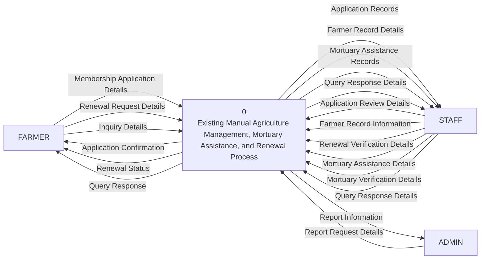

# Existing System Context-Level DFD

This context-level DFD models the existing manual agriculture management, mortuary assistance, and membership renewal process currently performed by the Municipal Agriculture Office.

Related diagrams:
- [Existing Level-1 DFD](/c:/xampp/htdocs/new_anitech/docs/existing-level1-dfd.md)
- [Existing Level-2 DFD](/c:/xampp/htdocs/new_anitech/docs/existing-level2-dfd.md)

## Existing DFD

## Main External Entities

- `FARMER` submits paper-based applications, renewal requests, and inquiries to the office.
- `STAFF` reviews documents, updates farmer records, verifies renewals, handles mortuary assistance processing, and prepares responses to farmer concerns.
- `ADMIN` requests consolidated reports from the manual records kept by the office.

## Suggested Diagram Title

`Context-Level Data Flow Diagram of the Existing Manual Agriculture Management, Mortuary Assistance, and Renewal Process`
