# Existing System Level-1 DFD

This level-1 DFD decomposes the existing manual agriculture management process into its major processing components based on the current office workflow, including manual handling of mortuary assistance requests.

Related diagrams:
- [Existing Context DFD](/c:/xampp/htdocs/new_anitech/docs/existing-context-dfd.md)
- [Existing Level-2 DFD](/c:/xampp/htdocs/new_anitech/docs/existing-level2-dfd.md)

## Existing Level-1 DFD

```mermaid
flowchart LR
    farmer[Farmer]
    staff[Staff]
    admin[Admin]

    p1["1<br/>Submit Membership Documents"]
    p2["2<br/>Handle Membership Applications"]
    p3["3<br/>Manage Farmer Records"]
    p4["4<br/>Process Membership Renewal"]
    p5["5<br/>Process Mortuary Assistance"]
    p6["6<br/>Address Farmer Queries"]
    p7["7<br/>Generate Reports and Records"]

    d1[(D1 Farmer Records File Cabinet)]
    d2[(D2 Membership Application File Folder)]
    d3[(D3 Renewal Record Logbook)]
    d4[(D4 Mortuary Assistance Logbook)]
    d5[(D5 Query Logbook)]

    farmer -->|Membership Application Details| p1
    p1 -->|Submitted Application Documents| d2
    p1 -->|Submission Confirmation| farmer
    d2 -->|Submitted Application Information| p2
    staff -->|Application Review Details| p2
    p2 -->|Application Status Details| staff
    p2 -->|Application Records| d2
    p2 -->|Reviewed Membership Application Record| d1

    staff -->|Farmer Record Information| p3
    d2 -->|Reviewed Membership Application Record| p3
    p3 -->|Farmer Record Information| d1
    d1 -->|Farmer Information| p3
    p3 -->|Farmer Record Details| staff

    d1 -->|Farmer Membership Information| p4
    staff -->|Renewal Verification Details| p4
    p4 -->|Renewal Records| d3

    d1 -->|Farmer Membership Information| p5
    staff -->|Mortuary Assistance Details| p5
    staff -->|Mortuary Verification Details| p5
    p5 -->|Mortuary Assistance Records| d4

    farmer -->|Inquiry Details| p6
    p6 -->|Query Response| farmer
    staff -->|Query Response Details| p6
    p6 -->|Query Information| d5
    d5 -->|Query Response Details| p6

    admin -->|Report Request Details| p7
    d1 -->|Farmer Record Information| p7
    d2 -->|Application Information| p7
    d3 -->|Renewal Information| p7
    d4 -->|Mortuary Assistance Information| p7
    p7 -->|Report Information| admin
```

## Main Processes

- `1 Submit Membership Documents` captures the paper application form and supporting documents submitted by the farmer.
- `2 Handle Membership Applications` is the office/staff handling of submitted membership applications, filing of application records, and forwarding of reviewed application records for farmer record creation.
- `3 Manage Farmer Records` is an internal staff process for updating the farmer master records kept in the office file cabinet using reviewed application records and other farmer information.
- `4 Process Membership Renewal` is handled internally by staff using farmer membership information and records the result in the renewal logbook.
- `5 Process Mortuary Assistance` is handled internally by staff by reviewing assistance details, verifying eligibility, and recording the result in the mortuary assistance logbook.
- `6 Address Farmer Queries` records farmer concerns and staff responses in the query logbook.
- `7 Generate Reports and Records` compiles manual records from folders, logbooks, and file cabinets for reporting.

## Suggested Diagram Title

`Level-1 Data Flow Diagram of the Existing Manual Agriculture Management Process`
