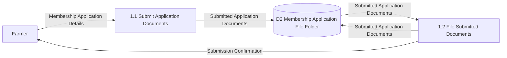
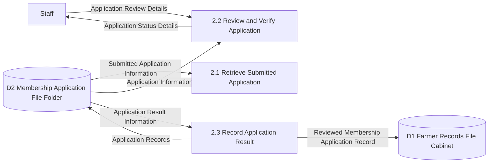
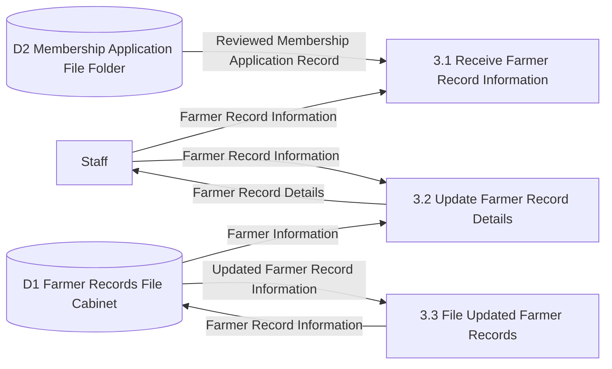
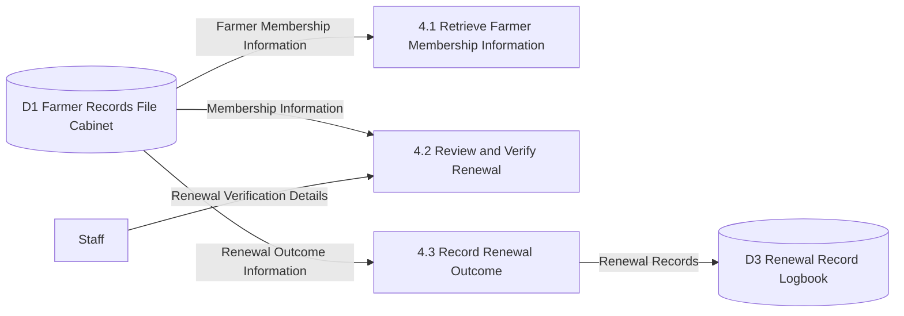
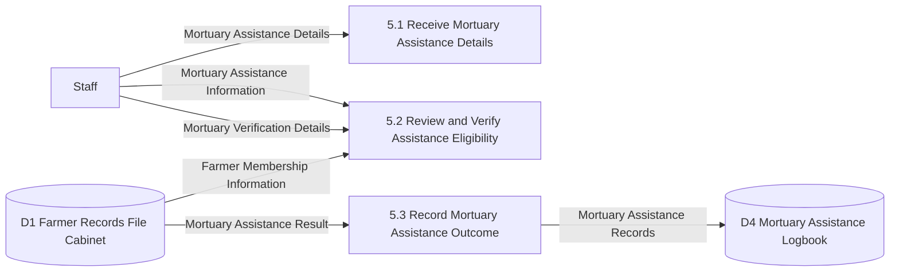
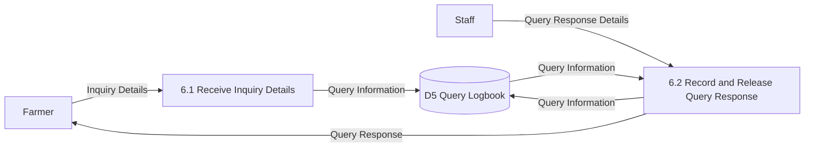
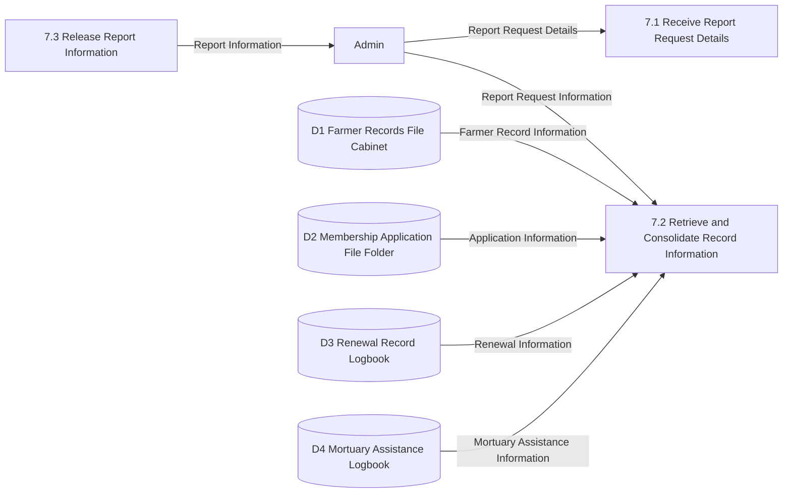

# Existing System Level-2 DFD

This level-2 DFD explodes the major level-1 processes of the existing manual agriculture management process into more detailed sub-processes based on the current office workflow, including manual handling of membership applications, renewals, mortuary assistance, and reporting.

Related diagrams:
- [Existing Context DFD](/c:/xampp/htdocs/new_anitech/docs/existing-context-dfd.md)
- [Existing Level-1 DFD](/c:/xampp/htdocs/new_anitech/docs/existing-level1-dfd.md)

## Existing Level-2 DFD for Process 1: Submit Membership Documents

## Existing Level-2 DFD for Process 2: Handle Membership Applications

## Existing Level-2 DFD for Process 3: Manage Farmer Records

## Existing Level-2 DFD for Process 4: Process Membership Renewal

## Existing Level-2 DFD for Process 5: Process Mortuary Assistance

## Existing Level-2 DFD for Process 6: Address Farmer Queries

## Existing Level-2 DFD for Process 7: Generate Reports and Records

## Main Sub-Processes

- `1.1-1.2 Submit Membership Documents` covers submitting application documents to the office and filing the submitted papers.
- `2.1-2.3 Handle Membership Applications` covers retrieving submitted applications, reviewing and verifying them, recording the result, and storing the reviewed membership application record for farmer record use.
- `3.1-3.3 Manage Farmer Records` covers receiving reviewed application records and other farmer record information, updating farmer details, and filing updated records.
- `4.1-4.3 Process Membership Renewal` covers retrieving membership data, reviewing and verifying the renewal, and recording the outcome.
- `5.1-5.3 Process Mortuary Assistance` covers receiving assistance details, reviewing and verifying eligibility, and recording the result.
- `6.1-6.2 Address Farmer Queries` covers receiving inquiries and recording and releasing the response.
- `7.1-7.3 Generate Reports and Records` covers receiving report requests, retrieving and consolidating records, and releasing the report.

## Suggested Diagram Title

`Level-2 Data Flow Diagram of the Existing Manual Agriculture Management Process`
