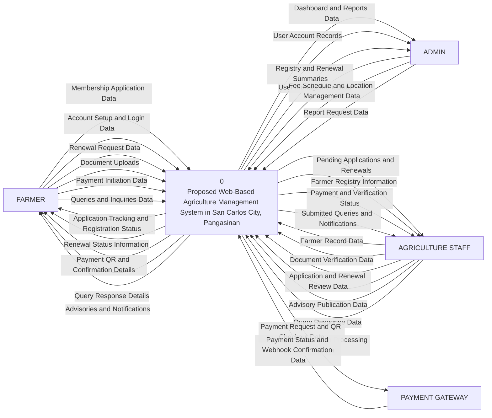

# Proposed System Level-0 DFD

This level-0 (context-level) DFD models the proposed digital agriculture management system implemented in this project.

Related diagram:
- [Proposed Level-1 DFD](/c:/xampp/htdocs/new_anitech/docs/proposed-level1-dfd.md)
- [Proposed Level-2 DFD](/c:/xampp/htdocs/new_anitech/docs/proposed-level2-dfd.md)

## Proposed Level-0 DFD

## Main External Entities

- `FARMER` submits applications, renewals, payments, documents, and queries through the farmer portal.
- `ADMIN` manages accounts, configuration data, and report generation.
- `AGRICULTURE STAFF` verifies documents, reviews transactions, updates farmer records, answers queries, and manages advisories and claims.
- `PAYMENT GATEWAY` processes online payment requests and returns payment confirmation data to the system.

## Suggested Diagram Title

`Level-0 Data Flow Diagram of the Proposed Web-Based Agriculture Management System`
