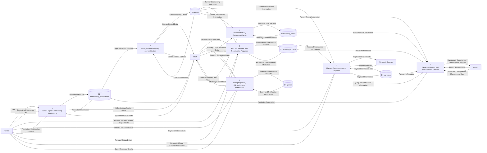

# Proposed System Level-1 DFD

This simplified level-1 DFD decomposes the proposed web-based agriculture management system into its major processing components using only the main data stores for a cleaner presentation.

## Proposed Simplified Level-1 DFD

## Main Processes

- `1 Handle Digital Membership Applications` receives online applications, supporting documents, and staff review actions.
- `2 Manage Farmer Registry and Verification` maintains the official farmer registry after application approval and staff validation.
- `3 Process Renewal and Reactivation Requests` handles renewal submissions, reactivation requests, and status tracking.
- `4 Manage Queries, Advisories, and Notifications` manages two-way communication between farmers and office staff.
- `5 Manage Assessments and Payments` computes assessments, creates payment requests, and records verified payments.
- `6 Process Mortuary Assistance Claims` records, verifies, and tracks mortuary assistance claims for eligible farmers.
- `7 Generate Reports and Administrative Records` consolidates operational data for dashboards, reports, and office administration.

## Simplification Notes

- Related tables are grouped into broader logical stores to keep the level-1 diagram readable.
- Detailed table-by-table decomposition remains available in [docs/proposed-level2-dfd.md](/c:/xampp/htdocs/new_anitech/docs/proposed-level2-dfd.md).

## Suggested Diagram Title

`Simplified Level-1 Data Flow Diagram of the Proposed Web-Based Agriculture Management System`
