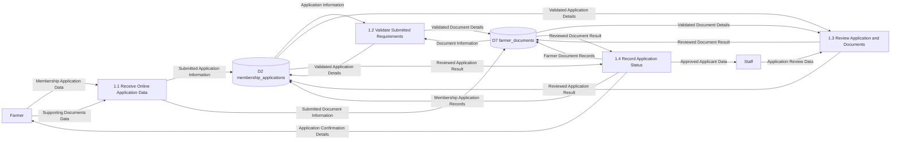
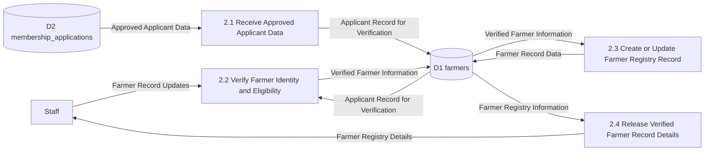
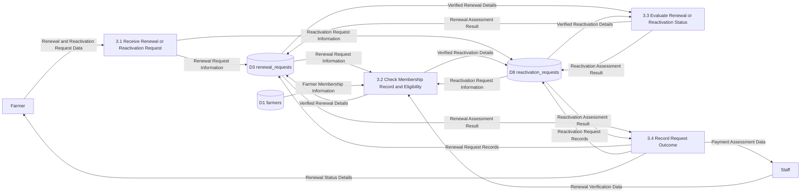
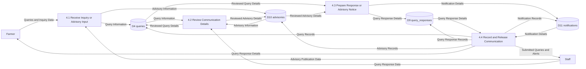
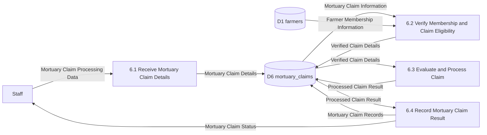
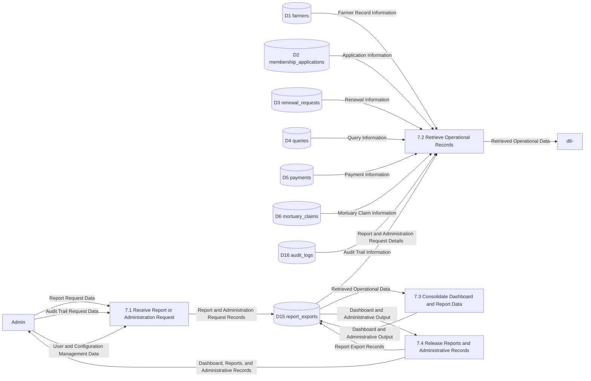

# Proposed System Level-2 DFD

This level-2 DFD explodes the major level-1 processes of the proposed web-based agriculture management system into more detailed sub-processes.

Data store numbering is kept consistent with the level-1 DFD for shared stores, while additional level-2-only stores are assigned new data store identifiers.

Related diagrams:
- [Proposed Level-0 DFD](/c:/xampp/htdocs/new_anitech/docs/proposed-context-dfd.md)
- [Proposed Level-1 DFD](/c:/xampp/htdocs/new_anitech/docs/proposed-level1-dfd.md)

## Proposed Level-2 DFD for Process 1: Handle Digital Membership Applications

## Proposed Level-2 DFD for Process 2: Manage Farmer Registry and Verification

## Proposed Level-2 DFD for Process 3: Process Renewal and Reactivation Requests

## Proposed Level-2 DFD for Process 4: Manage Queries, Advisories, and Notifications

## Proposed Level-2 DFD for Process 5: Manage Assessments and Payments

```mermaid
flowchart LR
    farmer[Farmer]
    gateway[Payment Gateway]
    d1[(D12 payment_assessments)]
    d2[(D5 payments)]
    d3[(D13 membership_ledgers)]
    d4[(D14 paymongo_webhook_events)]

    p51["5.1 Receive Payment Assessment or Payment Request"]
    p52["5.2 Generate Payment Reference and QR Details"]
    p53["5.3 Verify Gateway Payment Result"]
    p54["5.4 Record Ledger and Payment Confirmation"]

    d1 -->|Payment Assessment Data| p51
    farmer -->|Payment Initiation Data| p51
    p51 -->|Payment Assessment Records| d1
    p51 -->|Payment Request Records| d2
    d1 -->|Payment Assessment Details| p52
    d2 -->|Payment Request Details| p52
    p52 -->|Payment Request Data| gateway
    p52 -->|Payment QR and Reference Details| farmer
    gateway -->|Payment Verification Data| p53
    d2 -->|Pending Payment Information| p53
    d4 -->|Webhook Information| p53
    p53 -->|Verified Payment Result| d2
    p53 -->|Payment Webhook Event Records| d4
    d2 -->|Verified Payment Result| p54
    p54 -->|Payment Records| d2
    p54 -->|Membership Ledger Records| d3
    p54 -->|Payment QR and Confirmation Details| farmer
```

## Proposed Level-2 DFD for Process 6: Process Mortuary Assistance Claims

## Proposed Level-2 DFD for Process 7: Generate Reports and Administrative Records

## Main Sub-Processes

- `1.1-1.4 Handle Digital Membership Applications` covers receiving online applications, validating requirements, reviewing submissions, and recording application status.
- `2.1-2.4 Manage Farmer Registry and Verification` covers receiving approved applicant data, verifying identity and eligibility, updating registry records, and releasing verified farmer details.
- `3.1-3.4 Process Renewal and Reactivation Requests` covers receiving requests, checking membership eligibility, evaluating request status, and recording the result.
- `4.1-4.4 Manage Queries, Advisories, and Notifications` covers receiving communications, reviewing details, preparing responses or notices, and recording released communications.
- `5.1-5.4 Manage Assessments and Payments` covers receiving assessment or payment requests, generating payment references, verifying gateway results, and recording payment confirmations.
- `6.1-6.4 Process Mortuary Assistance Claims` covers receiving claim details, verifying eligibility, evaluating the claim, and recording the claim result.
- `7.1-7.4 Generate Reports and Administrative Records` covers receiving reporting and audit trail requests, retrieving operational records, consolidating report data, and releasing administrative outputs.

## Suggested Diagram Title

`Level-2 Data Flow Diagram of the Proposed Web-Based Agriculture Management System`
